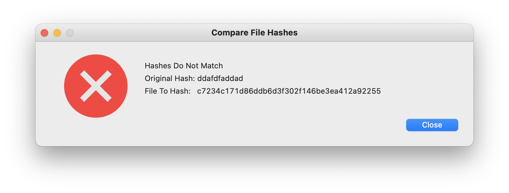

## Verify SHA1 Hashes

**Usage:** 

Type in the `SHA1` hash from the website you downloaded your file or package from. Then drag the download to the `File to compare` field and click on `Compare SHA1's`. 

Results will be "**Hashes Match**" or "**Hashes Do Not Match**"

SHA1 for `SHA1 Check.app.zip`:
> c7234c171d86ddb6d3f302f146be3ea412a92255
