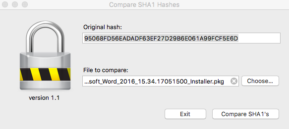
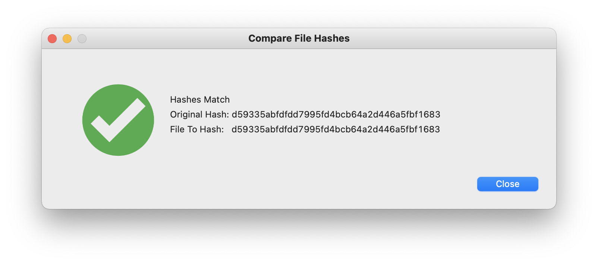

## Verify SHA1 Hashes

**Usage:**
Type in the `SHA1` hash from the website you downloaded your file or package from. Then drag the download to the `File to compare` field and click on `Compare SHA1's`. Results will be either '**Hashes are a match**', or "**Hashes are not a match"**

SHA1 for 'SHA1 Check.app.zip':
> d59335abfdfdd7995fd4bcb64a2d446a5fbf1683
